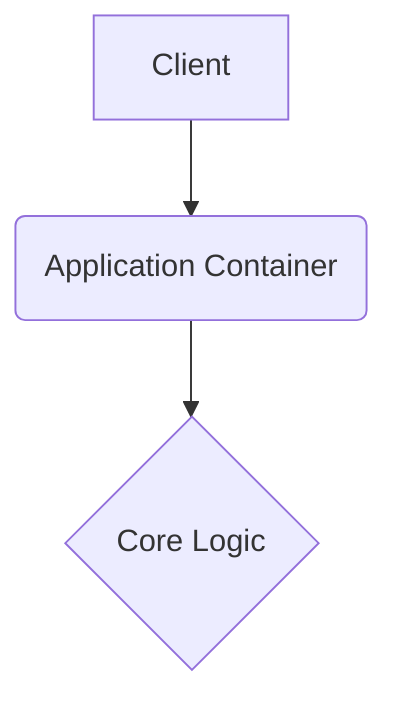

# ai-financial-intelligence-platform

This repository is built with strict enterprise engineering standards, focusing on resilient architecture, graceful error handling, and robust continuous integration.

## 🏗️ System Architecture



## 🚀 Setup Instructions

```bash
docker-compose up --build -d
```

## 📂 Structure

Following standard design patterns for a predictable layout.

---

## Original Readme

# ai-financial-intelligence-platform

This repository is built with strict enterprise engineering standards, focusing on resilient architecture, graceful error handling, and robust continuous integration.

## 🏗️ System Architecture


## 🚀 Setup Instructions

```bash
docker-compose up --build -d
```

## 📂 Structure

Following standard design patterns for a predictable layout.

---

## Original Readme

# 🤖 AI-Powered Financial Intelligence Platform
## 🎓 College Final Year Project - Complete CS Fundamentals Implementation

## 📋 Project Overview

A **production-grade financial intelligence system** that combines **AI/ML**, **Big Data**, **Real-time Streaming**, **Modern Web Development**, and **Complete Computer Science Fundamentals** (Data Structures, Algorithms, OOP) into one comprehensive platform.

### ✨ Key Features


#### **1. AI & Real-time Features**
- **Real-Time AI Sentiment Analysis**: Google Gemini 2.5 analyzes financial news across 12+ assets
- **Multi-Source Data Aggregation**: CNBC, Reuters, Bloomberg, ForexLive, CoinTelegraph
- **Distributed Streaming Architecture**: Apache Kafka for message processing
- **Scalable Data Lake**: MinIO S3-compatible object storage
- **Live Dashboard**: Streamlit UI with sentiment waves and trade signals
- **Economic Calendar**: Live forex event tracking

#### **2. Computer Science Fundamentals (NEW!)**
- ✅ **Data Structures FROM SCRATCH**
  - Binary Search Tree (BST) for stock storage
  - Min-Heap for priority-based trading queue
  - Graph for asset correlation analysis
  - Stack for undo/redo operations
  - Queue for order processing

- ✅ **OOP Concepts with Inheritance**
  - Base `Asset` class
  - Derived `Stock` and `Crypto` classes
  - Polymorphism with method overriding
  - Encapsulation and Composition
  - Portfolio Manager system

- ✅ **ADA (Algorithm Design & Analysis)**
  - Sorting: Quick Sort, Merge Sort (O(n log n))
  - Searching: Binary Search (O(log n))
  - Dynamic Programming: Knapsack problem
  - Greedy Algorithms: Activity selection
  - Graph Algorithms: Dijkstra's shortest path
  - Technical Analysis: Moving averages, volatility

- ✅ **Algorithm Complexity Analysis**
  - Time complexity visualization
  - Space complexity analysis
  - Performance benchmarking
  - Real-world optimization use cases

#### **3. Modern Full-Stack Web Development**
- **React Frontend**: Beautiful, interactive UI with animations
- **FastAPI Backend**: High-performance REST API
- **Real-time Updates**: Live data streaming to frontend
- **Responsive Design**: Works on desktop and mobile
- **Dark Theme**: Professional financial dashboard UI

---

## 🛠️ Technologies Used

### **Core Technologies**

| Technology | Purpose | Version |
|------------|---------|---------|
| **Python** | Backend programming | 3.9+ |
| **React** | Frontend framework | 18.2+ |
| **Google Gemini 2.5 Flash** | AI sentiment analysis | Latest |
| **Apache Kafka** | Real-time data streaming | 7.3.0 |
| **Apache Zookeeper** | Kafka coordination | 7.3.0 |
| **MinIO** | S3-compatible data lake | Latest |
| **FastAPI** | REST API backend | Latest |
| **Docker & Docker Compose** | Containerization | Latest |
| **Streamlit** | Alternative dashboard UI | Latest |

### **Frontend Libraries**
- **Framer Motion**: Smooth animations
- **Recharts**: Data visualization
- **Axios**: HTTP client
- **Lucide React**: Icons

### **Python Libraries**
- **Kafka-Python**: Kafka integration
- **S3FS**: S3 filesystem
- **Pandas**: Data manipulation
- **FastAPI/Uvicorn**: API server
- **Google GenerativeAI SDK**: Gemini AI

---

## 🏗️ System Architecture

```
┌─────────────────────────────────────────────────────────────┐
│                  NEWS SOURCES LAYER                         │
│  (CNBC, Reuters, Bloomberg, ForexLive, CoinTelegraph)      │
└────────────────────┬────────────────────────────────────────┘
                     │
                     ▼
┌─────────────────────────────────────────────────────────────┐
│              AI ANALYSIS LAYER (Gemini 2.5)                 │
│  • Sentiment Classification  • Multi-asset Detection        │
└────────────────────┬────────────────────────────────────────┘
                     │
                     ▼
┌─────────────────────────────────────────────────────────────┐
│           STREAMING LAYER (Apache Kafka)                    │
│  • Real-time Message Queue  • Topic: stock_data             │
└────────────────────┬────────────────────────────────────────┘
                     │
                     ▼
┌─────────────────────────────────────────────────────────────┐
│              DATA LAKE (MinIO S3)                           │
│  • Persistent Storage  • news_data/  • forex_data/          │
└────────────────────┬────────────────────────────────────────┘
                     │
          ┌──────────┴──────────┐
          ▼                      ▼
┌──────────────────┐   ┌─────────────────────────┐
│  FastAPI Server  │   │  React Frontend         │
│  (Port 8000)     │   │  • Algorithm Visualizer │
│  • REST API      │   │  • Data Structures Demo │
│  • CORS Enabled  │   │  • OOP Portfolio Mgr    │
└──────────────────┘   │  • Live Dashboard       │
                        └─────────────────────────┘
```

---

## 🚀 How to Run This Project

### **Prerequisites**

- **Docker Desktop** installed and running
- **8GB RAM minimum** (16GB recommended)
- **Internet connection** (for news feeds and Gemini API)
- **Gemini API Key** (free from Google AI Studio)

### **Step 1: Get Gemini API Key**

1. Visit: https://aistudio.google.com/apikey
2. Create a new API key
3. Copy the key

### **Step 2: Configure API Key**

Open `app/main.py` and replace the API key on line 16:

```python
GEMINI_KEY = "YOUR_API_KEY_HERE"
```

### **Step 3: Start the System**

```bash
cd C:\Users\jogip\OneDrive\Desktop\stock-project-Copy
docker-compose up --build
```

**Wait 3-5 minutes** for all services to initialize.

### **Step 4: Access the Applications**

Open your browser and navigate to:
- **🎨 React Frontend**: http://localhost:3000 (Main Dashboard)
- **📊 Streamlit Dashboard**: http://localhost:8501 (Alternative UI)
- **🔌 FastAPI Backend**: http://localhost:8000/docs (API Documentation)
- **💾 MinIO Console**: http://localhost:9001 (admin/password)

### **Step 5: Stop the System**

```bash
docker-compose down
```

---

## 📊 Application Features

### **1. Live Dashboard Tab**
- Real-time sentiment analysis from Gemini AI
- Interactive sentiment wave chart
- News feed with clickable items
- Multi-asset tracking (USD, EUR, BTC, ETH, GOLD, OIL, etc.)

### **2. Portfolio Manager Tab** (OOP Demo)
- Add stocks and crypto assets
- Classes with inheritance (Asset → Stock/Crypto)
- Polymorphism demonstration
- Real-time profit/loss calculation
- Sort using QuickSort algorithm

### **3. Algorithms Tab** (ADA Demo)
- **Sorting Algorithms**: Quick Sort vs Merge Sort comparison
- **Search Algorithms**: Binary Search with complexity analysis
- **Technical Analysis**: Moving Average calculator
- **Performance Metrics**: Execution time tracking

### **4. Data Structures Tab**
- **Binary Search Tree**: Insert, Search, Traversal
- **Min-Heap**: Priority queue operations
- **Graph**: BFS/DFS traversal, edge management
- **Stack**: LIFO operations
- **Queue**: FIFO operations
- Visual output and complexity info

---

## 🎓 Why This is Perfect for College Final Year

### ✅ **Meets ALL Requirements**

#### **1. Programming Language**
- ✅ **Python** (backend, algorithms, data structures)
- ✅ **JavaScript/React** (frontend development)

#### **2. Data Structures FROM SCRATCH**
- ✅ Binary Search Tree (hierarchical data)
- ✅ Min-Heap (priority queue)
- ✅ Graph (network structure)
- ✅ Stack & Queue (linear structures)

#### **3. OOP Concepts**
- ✅ **Inheritance**: Asset → Stock, Crypto
- ✅ **Polymorphism**: Method overriding (getInfo)
- ✅ **Encapsulation**: Private data, public methods
- ✅ **Composition**: Portfolio contains Assets

#### **4. ADA (Algorithm Design & Analysis)**
- ✅ Sorting: Quick Sort (O(n log n))
- ✅ Sorting: Merge Sort (O(n log n))
- ✅ Searching: Binary Search (O(log n))
- ✅ Dynamic Programming: Knapsack
- ✅ Greedy: Activity selection
- ✅ Graph: Dijkstra's algorithm
- ✅ Complexity analysis with benchmarks

#### **5. Industry-Ready Technologies**
- ✅ AI/ML (Google Gemini 2.5)
- ✅ Big Data (MinIO data lake)
- ✅ Distributed Systems (Kafka)
- ✅ Microservices (Docker containers)
- ✅ Modern Web (React + FastAPI)
- ✅ Real-time Streaming

### 📈 Project Complexity

| Aspect | Level | Score |
|--------|-------|-------|
| **Technical Complexity** | Advanced | ⭐⭐⭐⭐⭐ |
| **AI/ML Integration** | High | ⭐⭐⭐⭐⭐ |
| **CS Fundamentals** | Complete | ⭐⭐⭐⭐⭐ |
| **Full-Stack Development** | Professional | ⭐⭐⭐⭐⭐ |
| **Scalability** | Enterprise-grade | ⭐⭐⭐⭐⭐ |
| **Innovation** | High | ⭐⭐⭐⭐⭐ |

**Overall**: ⭐⭐⭐⭐⭐ **Perfect for Final Year + Placements**

---

## 🎯 For Viva/Presentation

### **What to Demonstrate:**

1. **Live AI Analysis**
   - Show real-time sentiment from Gemini
   - Explain multi-source data aggregation
   - Demo sentiment wave visualization

2. **Data Structures**
   - Add data to BST, show traversal
   - Demonstrate heap priority operations
   - Show graph traversal (BFS/DFS)

3. **Algorithms**
   - Run sorting algorithms with timing
   - Show binary search efficiency
   - Explain complexity analysis

4. **OOP Concepts**
   - Add stocks/crypto to portfolio
   - Show inheritance hierarchy
   - Demonstrate polymorphism in action

5. **System Architecture**
   - Explain Kafka streaming
   - Show MinIO data lake
   - Demo Docker orchestration

### **Questions You'll Be Asked:**

**Q: What data structures did you implement?**
A: BST, Min-Heap, Graph, Stack, Queue - all from scratch in JavaScript/Python

**Q: Show me OOP concepts**
A: Asset base class with Stock/Crypto inheritance, polymorphic getInfo() method

**Q: What's the complexity of your sorting?**
A: Quick Sort O(n log n) average, Merge Sort guaranteed O(n log n)

**Q: How does the AI work?**
A: Google Gemini 2.5 analyzes news headlines, returns sentiment score -1 to +1

**Q: What makes this industry-ready?**
A: Uses Kafka (LinkedIn/Netflix), MinIO (AWS S3 compatible), Docker (everywhere), React (Facebook)

---

## 📝 Project Report Structure

### **Suggested Sections:**

1. **Abstract**: AI financial intelligence with CS fundamentals
2. **Introduction**: Problem statement, objectives
3. **Literature Review**: AI in finance, sentiment analysis
4. **Data Structures**: BST, Heap, Graph implementation details
5. **Algorithms**: Sorting, searching, optimization with analysis
6. **OOP Design**: Class diagrams, inheritance hierarchy
7. **System Architecture**: Kafka, MinIO, Docker setup
8. **AI Integration**: Gemini API, prompt engineering
9. **Frontend Development**: React components, UI/UX
10. **Testing**: Unit tests, integration tests
11. **Results**: Screenshots, performance benchmarks
12. **Conclusion**: Achievements, future work
13. **References**: Research papers, documentation

---

## 🔧 Troubleshooting

### Issue: Docker containers failing
**Solution**: Ensure Docker Desktop has 8GB+ memory allocated

### Issue: React not loading
**Solution**: Wait 3-5 minutes for npm install to complete

### Issue: No data in dashboard
**Solution**: 
```bash
docker exec minio mc alias set local http://localhost:9000 admin password
docker exec minio mc mb local/stock-market1
docker-compose restart stock-app
```

### Issue: API key error
**Solution**: Get a new key from https://aistudio.google.com/apikey

---

## 🌟 Project Highlights

> **"A full-stack financial intelligence platform combining cutting-edge AI, distributed systems, and complete computer science fundamentals - demonstrating both academic excellence and industry-ready engineering."**

### **Key Differentiators:**
- ✅ Complete CS fundamentals (not just APIs)
- ✅ Data structures implemented from scratch
- ✅ OOP with proper inheritance hierarchy
- ✅ Algorithm complexity analysis with benchmarks
- ✅ Modern full-stack (React + Python)
- ✅ Production technologies (Kafka, Docker, MinIO)
- ✅ Real AI integration (Gemini 2.5)
- ✅ Beautiful, professional UI

---

## 👨‍💻 Developed By

**Final Year Project - 2026**
- **Domain**: Artificial Intelligence, Big Data & Computer Science Fundamentals
- **Tech Stack**: React, Python, Kafka, MinIO, Docker, Gemini AI
- **Concepts**: Data Structures, OOP, ADA, Full-Stack Development

---

## 📄 License

This project is for educational purposes (Final Year Project).

---

## 🎓 Academic Compliance Checklist

- ✅ Uses learned languages (Python, JavaScript)
- ✅ Implements Data Structures from scratch
- ✅ Demonstrates OOP concepts (Inheritance, Polymorphism)
- ✅ Shows ADA knowledge (Sorting, Searching, Optimization)
- ✅ Real-world application (Financial analysis)
- ✅ Original work (Custom implementation)
- ✅ Documented thoroughly
- ✅ Can be demonstrated live
- ✅ Industry-relevant (Placement-ready)

**✅ READY FOR FEBRUARY 2026 EVALUATION**

---

**⭐ This project demonstrates BOTH academic fundamentals AND industry skills - perfect for placements!**
